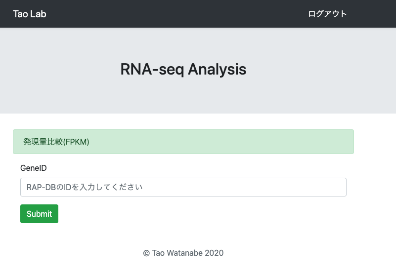
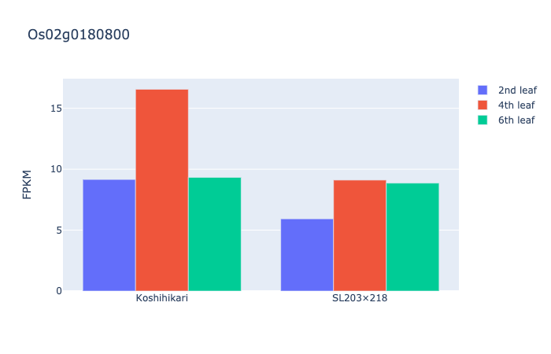

# TaoLab

イネのRNA-seq解析の発現データ(約3万遺伝子)にラボメンバーが手軽にアクセスできるよう、作成。

RAP-DBのgene-idを入力すれば、棒グラフが描画され、発現量が取得できる。

# 使用スキル
html/css/Bootstrap/Python/Django

# 機能

* ログイン機能
* グラフ描画

# スクリーンショット

 

# 制作者

渡部太緒
